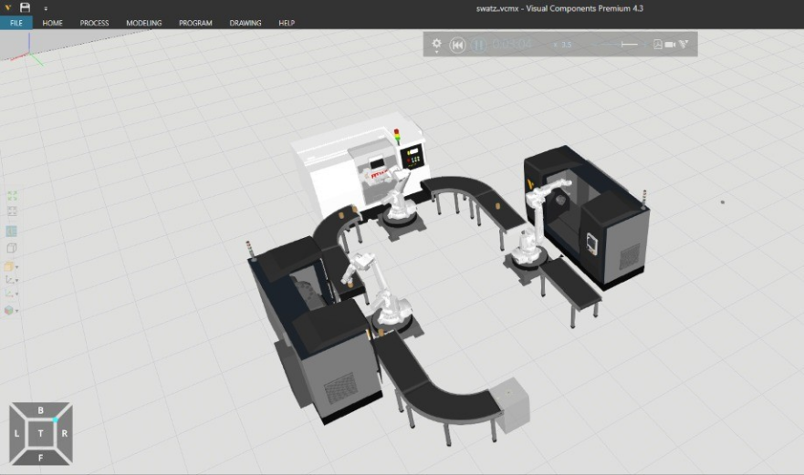
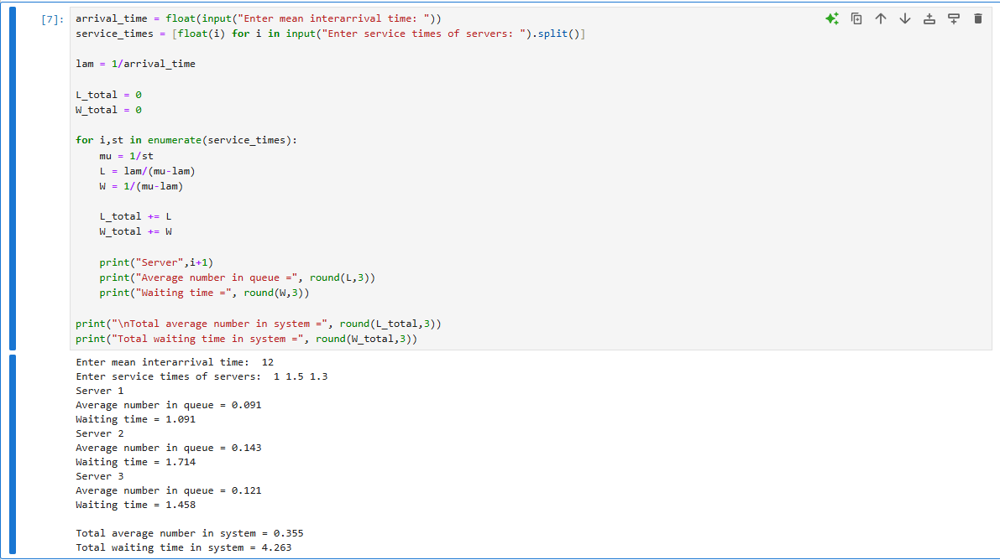

# Series Queues with infinite capacity - Open Jackson Network

# date : 10/03/2026

## Aim :
To find (a) average number of materials in the system (b) average number of materials in the each conveyor of (c) waiting time of each material in the system (d) waiting time of each material in each conveyor, if the arrival  of materials follow Poisson process with the mean interval time 12 seconds, service time of  lathe machine in series follow exponential distribution  with service time  1 second, 1.5 seconds and 1.3 seconds respectively and average service time of robot is 7 seconds.

## Software required :
Visual components and Python

## Theory


## Procedure :


## Experiment:



## Program

```
developed by : Ryan David Prasad
reg. no : 212224040282

arrival_time = float(input("Enter mean interarrival time: "))
service_times = [float(i) for i in input("Enter service times of servers: ").split()]

lam = 1/arrival_time

L_total = 0
W_total = 0

for i,st in enumerate(service_times):
    mu = 1/st
    L = lam/(mu-lam)
    W = 1/(mu-lam)

    L_total += L
    W_total += W

    print("Server",i+1)
    print("Average number in queue =", round(L,3))
    print("Waiting time =", round(W,3))

print("\nTotal average number in system =", round(L_total,3))
print("Total waiting time in system =", round(W_total,3))
```

## Output



## Result

Thus the program is implemented and executed successfully.
